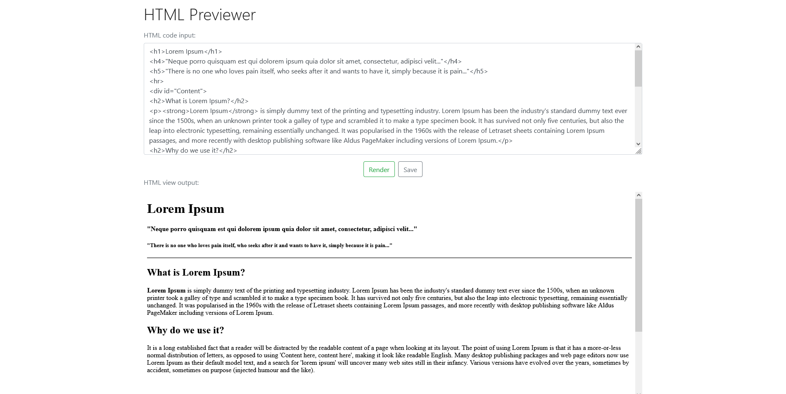

# HTMLPreviewer
Web application for saving and previewing HTML code.

## Description
Made by Hristo Shirov for a practical assignment. Fully functional ASP.NET 5 MVC application using various technologies.

### Details
The application is capable of visualizing the HTML code that the user inputs, and saving it to a database. 
The saved code can be accessed by its ID and further edited.

## Note for the database
The MSSQL database is automatically created on startup with the name "HTML_Previewer_Db_Dev".

## Structure of the project
Three-tier architecture following the MVC pattern

### Data Layer
- Code First database approach
- MSSQL Server Database
- Entity Framework Core

### Service Layer
- Data services handling access and the logic of the application
- Asynchronous programming is used whenever possible
- AutoMapper

### Presentation Layer
- ASP.NET 5
- Bootstrap
- Responsive design

### Tests
- Technologies
  - NUnit
  - InMemory database
- Unit tests of the service layer use **InMemory database** and cover all logic operations

## Summary
This project serves as a functional code previewer that can be a part of a bigger system.
